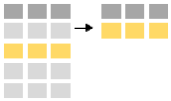
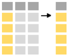
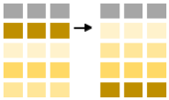
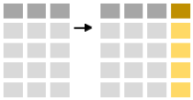
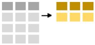

```{r, echo = FALSE}
library(knitr)
library(grid)
knitr::opts_chunk$set(warning = FALSE,
                      message = FALSE)

knitr::opts_chunk$set(out.width = '750px', dpi = 200)
```

```{r, width = 150, echo = FALSE, eval = FALSE}
include_graphics("img/data_science.png")
```

TODO: Create exercises

# Preamble
___

Commonly, when collating summaries by group, one wants to:

* **Split** up a big data structure into homogeneous pieces,
* **Apply** a function to each piece
* **Combine** all the results back together.

```{r, width = 150, echo = FALSE, eval = FALSE}
include_graphics("img/split-apply-combine.png")
```

For example, one might want to:

* Calculate summary statistics for each category
* Perform group-wise transformations like scaling or standardizing
* Fit the same model to different subset of the data

The tidyverse packages, through the dplyr and tidyr, offer a set of tools for a common set of problems connected to aggregates or summaries of data.

* Similar to ggplot2 they feature a Domain Specific Language (DSL) specially designed for data summaries.
* Developed by Hadley Wickam, the creator ggplot2 and other useful tools.

Essentially dplyr and tidyr offer a collection of simple but powerful commands (or verbs) that facilitate this split-apply-combined process:

* **filter**: keep rows matching criteria
* **select**: pick columns by name
* **arrange**: order the rows according to a variable
* **mutate**: add new variables
* **summarise**: reduce variables to values
* **group_by**: gives the group to apply the analysis functions to 

The structure of these commands is always the same:

* First argument to the function is a data frame
* Always return a data frame
* Subsequent arguments say what to do with data frame
* (Never modify in place)
* It recognizes the columns of the data.frame as variables, that is only need to write `col.name` instead of `dat$col.name`

#### Reading material 

* [R for Data Science](http://r4ds.had.co.nz/transform.html)
* [Data Transformation Cheat Sheet](https://github.com/rstudio/cheatsheets/raw/master/data-transformation.pdf)


#### Getting example data into R
```{r}
library(tidyverse)
d <- 
  read_csv("ftp://ftp.hafro.is/pub/tcrenv/minke_reduced.csv")
glimpse(d)
```

# Manipulate Cases
___

## **filter**: Extract rows that meet logical criteria

```{r, width = 150, echo = FALSE, eval = FALSE}

```

One can extract rows that meet logical criteria by using the `filter` command. The first argument is the name of the data frame with subsequent argument(s) being logical expressions. E.g. one subset the minke data containing only data from 2005 by:

```{r}
filter(d, year == 2005)
```

Using subsequent arguements one can refine the subset further:
```{r}
filter(d, year == 2005, year <= 2006)
```

Filter takes any logical statement:
```{r,eval=FALSE}
 a == b   ## a is equal to b
 a != b   ## a is not equal to b
 a > b    ## a is greater than b
 a >= b   ## a is greater or equal to b
 a < b    ## a is less than b
 a <= b   ## a is less or equal to b
 a & b    ## a and b
 a | b    ## a or b
 !a       ## not a
 is.na(a) ## is a equal to NA (missing)
 a %in% b ## what elements of column a are also in column b 
```

The arguements can operate on different variables. E.g. to extract mature males caught in 2007 one would write:

```{r, eval = FALSE}
filter(d, maturity == "mature", sex == "Male", year == 2007)
```

A "comma" is recognized as "AND". If one were to specify "OR" use the "|":

```{r, eval = FALSE}
filter(d, maturity == "mature" | sex == "Male" | year == 2007)
```

<div class="panel panel-warning">
<div class="panel-heading">Exercise</div>
<div class="panel-body">

* Find all males caught in the northern area in 2006 and 2007
* Find all minke whales caught that did not have a maturity status
* Find all minke whales that were caught in year 2007 or were mature males

```{r, echo = FALSE, eval = FALSE}
filter(d, year == 2007 | (maturity == "mature" & sex == "Male"))
```

</div>
</div>

## **select**: Extract columns by name

```{r,width=150,echo=FALSE, eval = FALSE}

```

The `select` functions allows you to extract certains columns:
```{r}
select(d, id, year, maturity)
```

You can also omit certain columns using negative indexing: for example you can select all columns except `length`:
```{r}
select(d, -length)
```

The `select` function can use a couple of fairly useful helper function:

```{r,eval=FALSE}
starts_with('stomach')  ## Finds all columns that start with "stomach"
ends_with('weight')     ## Finds all columns that end with "weight"
id:age       ## Finds all columns between "id" and "age"
contains('mach')      ## Finds all columns that contain "mach"
-date           ## Remove column "date" from the dataset
```

And you can of course combine these at will:
```{r}
select(d, id:length, starts_with('stomach'))
```

`select` also allows you to rename columns as you select them:
```{r}
select(d, id, year.caught = year)
```

but this only selects the requested columns.

## **rename**: Rename columns

If you just want to rename a couple of columns in the data frame leaving the other columns intact you can use the function `rename`:

```{r}
rename(d, year.caught = year)
```


<div class="panel panel-warning">
<div class="panel-heading">Exercise</div>
<div class="panel-body">

* Select age, length and id from the minke dataset, and rename id to "whale_id"
* Select the weight columns using the `contains` function

</div>
</div>

## **arrange**: Order rows by values of a column

```{r,width=150,echo=FALSE, eval = FALSE}

```

Arrange by length (in ascending order):
```{r}
arrange(d, length)
```

and in descending order:
```{r}
arrange(d, desc(length))
```

You can also arrange by more that one column:
```{r}
arrange(d, sex, desc(stomach.volume))
```

## **mutate**: Compute new column

```{r,width=150,echo=FALSE, eval = FALSE}

```

Mutate allows you to add new columns to your data. Let's calculate the approximate weight
```{r}
mutate(d, computed_weight = 0.00001 * length^3)
```

You can also do more than one "mutation":
```{r}
d2 <- select(d, id, length, weight)
mutate(d2,
       computed_weight = 0.00001 * length^3,
       approx_weight = ifelse(is.na(weight), 0.00001 * length^3, weight))
```

To make our lives a bit easier mutate can "remember" the last result:

```{r}
mutate(d2,
       computed_weight = 0.00001 * length^3,
       approx_weight = ifelse(is.na(weight), computed_weight, weight))
```

<div class="panel panel-warning">
<div class="panel-heading">Exercise</div>
<div class="panel-body">

* Add a column to the minke whale dataset where Fullton's condition factor, $K=100.000(W/L^3)$, is calculated

</div>
</div>

# Summarise cases

## **summarise**: create a condensed (summary) table

```{r,width=150,echo=FALSE, eval = FALSE}

```

Used to create summaries of the data:
```{r}
summarise(d,
          n.obs = n(),
          ml = mean(length, na.rm = TRUE))
```

## **group_by**: created a "grouped" copy of a table

```{r,width=150,echo=FALSE}
include_graphics("img/group_summarise.png")
```

The power of the command `summarise` is revealed when used in conjunction with `group_by`. The latter functions splits the data into groups based on one or multiple variables. E.g. one can split the minke table by maturity:

```{r}
by_maturity <- 
  group_by(d, maturity)
by_maturity
```

The table appears "intact" because it still has 190 observations but it has 6 groups, representing the different values of the maturity scaling in the data (anoestrous, immature, mature, pregnant, pubertal and "NA").

The `summarise`-command respects the grouping, as shown if one uses the same command as used above:
```{r}
summarise(by_maturity,
          n.obs = n(),
          ml = mean(length, na.rm = TRUE))
```

EXERCISE ???

# Combining verbs
___

In R one can apply functions to data repeatedly:
```{r}
summarise(group_by(d, sex, year), obs = n())
```

All this quickly becomes cumbersome and hard to read, for example what does this do?

```{r,eval=FALSE}
arrange(summarise(group_by(d, sex, year), obs = n()), desc(obs))
```

## The `%>%` operator

dplyr allows chaining of operators using the `%>%` operator

```{r}
d %>% 
  group_by(sex, year) %>% 
  summarise(obs = n()) %>% 
  arrange(desc(obs))
```

This needs a bit of explaining. Noticed that the first argument in each function is missing. Instead of calling a function with `f(x,y)` you can do `x %>% f(y)`, that is "take x, then apply f with a setting y". This essentially means that `%>%` operator takes the stuff on the left and places it as the first argument to function on the right hand side. This get infinitely more useful when you start creating longer chains: 

```{r}
d %>%
  mutate(computed_weight = 0.00001 * length^3,
         weight_approx = ifelse(!is.na(weight), weight, computed_weight),
         K = 100 * weight * 1000 / length^3) %>% 
  group_by(sex, year) %>% 
  summarise(n=n(),
            ml = mean(length, na.rm = TRUE),
            sl = sd(length, na.rm = TRUE),
            mK = mean(K, na.rm = TRUE),
            sK = sd(K, na.rm = TRUE)) %>% 
  arrange(year)
```

Hadley recomends that you "read" the `%>%` as **"then"**. Hence the above can be read as:

1. take data d
2. then split into groups by sex and year
3. then calculate the mean and standard deviation of length and K for each group
4. then arrange by year

Note that Rstudio has a built in shortcut for the `%>%` operator, [ctrl] + [shift] + M.


<div class="panel panel-warning">
<div class="panel-heading">Exercise</div>
<div class="panel-body">


* How do you produce this table:
```{r,echo=FALSE}
d %>%
  mutate(computed_weight = 0.00001*length^3,
         weight_approx = ifelse(!is.na(weight),weight,computed_weight),
         K = 100*weight*1000/length^3) %>% 
  group_by(sex,maturity) %>% 
  summarise(n=n()) %>% 
  spread(sex,n)
```

</div>
</div>


Useful helper function
```{r,eval=FALSE}
n()             ## counts the number of rows
n_distinct(x)   ## counts the number distinct values of x
first(x)        ## first value of x
last(x)         ## last value of x
nth(x,n)        ## nth value of x  
```


<div class="panel panel-warning">
<div class="panel-heading">Exercise</div>
<div class="panel-body">

* How many females were caught in the Northern area
* Calculate the mean stomach volume and standard deviation of all whales caught

</div>
</div>

