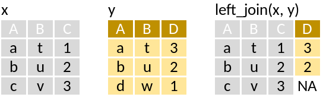
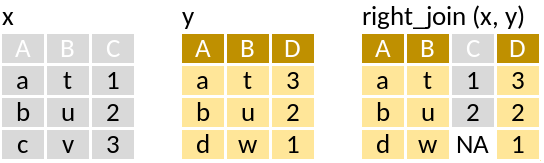
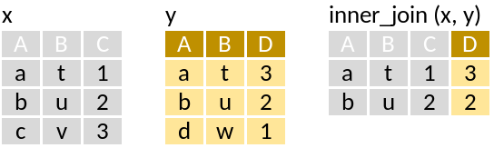
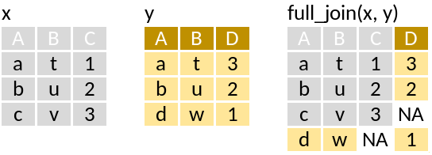
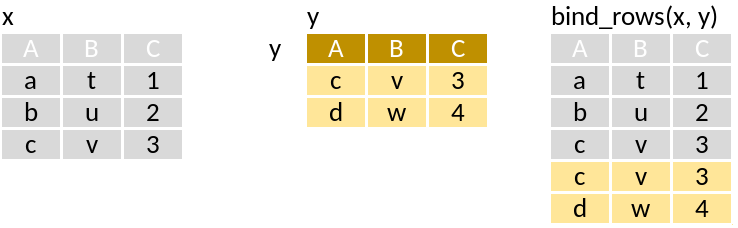
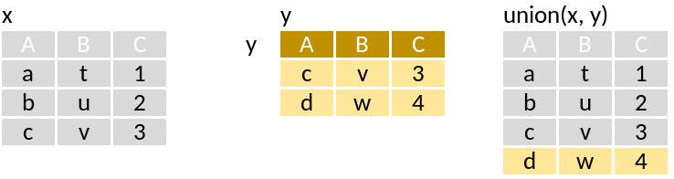
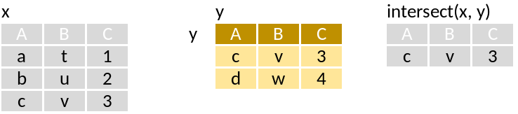
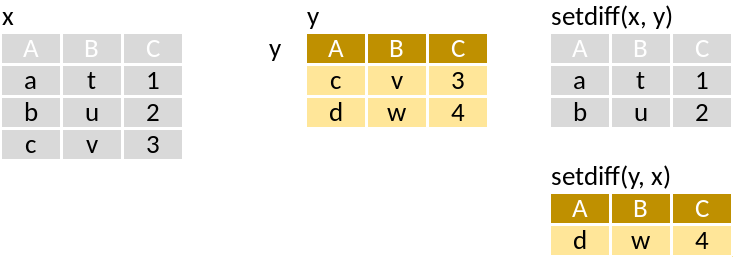

```{r, echo = FALSE}
knitr::opts_chunk$set(warning = FALSE, message = FALSE)
```

```{r}
library(tidyverse)
```

```{r}
x <- data_frame(A = c("a", "b", "c"),
                B = c("t", "u", "v"),
                C = c(1, 2, 3))
y <- data_frame(A = c("a", "b", "d"),
                B = c("t", "u", "w"),
                D = c(3, 2, 1))
```


# Combine variables
___

## **left_join**: Join matching values from y to x

```{r echo = FALSE}

```

```{r}
left_join(x, y)
```

## **right_join**: Join matching values from x to y

```{r echo = FALSE}

```

```{r}
left_join(y, x)
```

## **inner_join**: Join data. Retain only rows with matches

```{r echo = FALSE}

```

```{r}
inner_join(x, y)
```


## **full_join**: Join data. Retain all values, all rows

```{r echo = FALSE}

```

```{r}
full_join(x, y)
```

# Combine cases
___

```{r}
y <- data_frame(A = c("c", "d"),
                B = c("v", "w"),
                C = c(3, 4))
```


## **bind_rows**: Returns tables one on top of the other as a single table.

```{r echo = FALSE}

```

```{r}
bind_rows(x, y)
```

## **union**: Rows that appear in x or y

```{r echo = FALSE}

```


```{r}
union(x, y)
```

## **intersect**: Rows that appear in both x and y.

```{r echo = FALSE}

```


```{r}
intersect(x, y)
```

## **setdiff**: Rows that appear in x but not y

```{r echo = FALSE}

```


```{r}
setdiff(x, y)
setdiff(y, x)
```


TODO: Assignment

